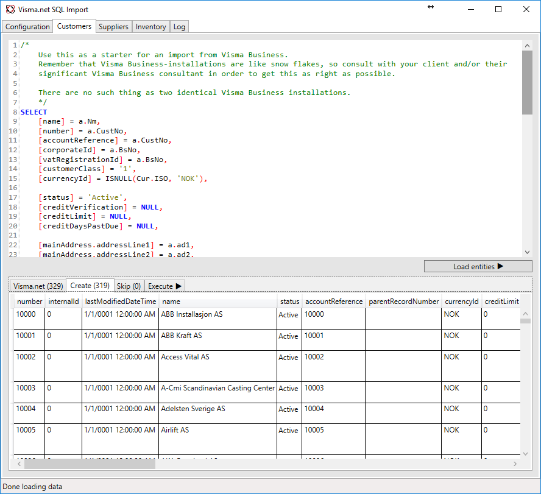

# Visma.net SQL Import

Convert from **any** ERP system that uses **SQL Server** using the Visma.net SQL Import from ON IT AS.

[See contact information](#get-in-touch)

## Currently supported

 * Customers
 * Suppliers
 * Inventory

## ERP Systems

 * [Visma Global](Visma Global)
 * [Visma Business](Visma Business)
 * [Uni Micro](Uni Micro)
 * [Excel or CSV](Flat File)

You can create custom queries from scratch if you want, but I'd suggest you start with the files in the [Boilerplates folder](bolderplate/)

## Screenshots

### Setup
First setup your token and select the company you want to import to. Then setup the connection to your SQL Server. 
It will try to connect to localhost using a trusted connection as default. Select the database you want to import from.

### Creating the query and previewing the import
There's a tab for each entity type you can import. Select the entity you want and create your query. 
Press "Load entities" in order to create a preview of what will be imported to Visma.net. This will also fetch 
all existing customers from Visma.net and do a duplicate check on Name, CorporateId and vatRegistrationId in order to 
avoid duplicates.

### The LogViewer
Get a full overview of what's going on by going to the Log tab.

Tip: Check for errors or warnings here when you've loaded a query.

## Get in touch
Contact Ole Melhus by emailing [ole@on-it.no](mailto:ole@on-it.no) or calling +47 99508374.